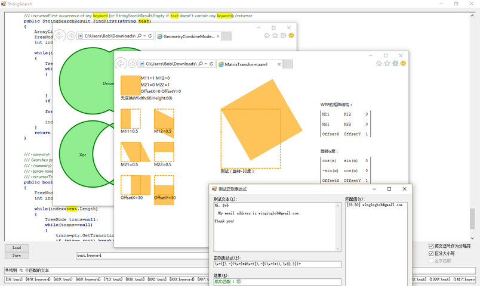

# some csharp code demo

just some old code.

* source\*.cs can be complited by csc.exe
* source\*.xaml can be open with ie-xaml presenter
* source\codesnippets can't to compite.
* source\FOLDERS is can be upgrade and complited with Visual Studio 2015
